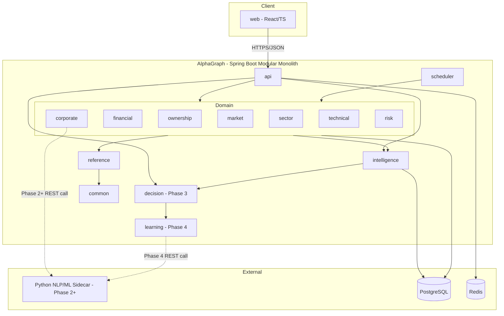

# 001 — System Architecture

## 1. Purpose

Defines the shape of AlphaGraph as a platform: architectural style, module boundaries, dependency rules, and the cross-cutting concerns every module must respect. This document governs Phase 0 and constrains every phase after it — new capability is added by filling in modules that already have a place, not by inventing new seams under time pressure.

Out of scope for this document (and for Phase 0 generally): scoring algorithms, AI/NLP logic, dashboards, recommendations. Those are business logic and belong to Phase 1+.

## 2. Architectural Style — Modular Monolith

AlphaGraph is built as a single deployable Spring Boot application composed of strongly-bounded modules (Gradle/Maven multi-module, one module = one Java package root = one Postgres schema).

Rationale:
- A platform like this (Bloomberg/FactSet-style) needs correctness and consistency in its data layer far more than it needs independent scaling in year one. Distributed systems overhead (network calls, eventual consistency, service discovery) is a cost with no payoff at this stage.
- Module boundaries are enforced at compile time (package-private internals, explicit public API per module) so that when a module *does* need to become a microservice later, the extraction is mechanical: the module already only talks to the outside world through its declared interface.
- One deployable, one database connection pool, one log stream — this keeps Phase 0 operational overhead near zero.

## 3. Module Map

| Module | Responsibility | Phase introduced |
|---|---|---|
| `common` | Shared kernel: base entities, exceptions, utility types, value objects. No dependencies on any other module. | 0 |
| `reference` | Master/reference data: exchanges, instruments, sectors, calendars. Structure + seed data only. | 0 |
| `scheduler` | Orchestrates pipeline runs (Module 0.8 flow: Download → Validate → Process → Calculate → Score → Notify). Owns no business logic, only sequencing and retry. | 0 |
| `market` | Market data domain: OHLC, volume, delivery %, market cap. | 1 |
| `financial` | Fundamentals domain: sales, PAT, EPS, ROE, ROCE, margins, cash flow. | 1 |
| `ownership` | Promoter/FII/DII/MF holding data. | 1 |
| `corporate` | Corporate actions, orders, results, filings, transcripts. | 1–2 |
| `sector` | Sector classification and sector-level aggregation. | 1 |
| `technical` | Technical engine (trend, momentum, breakout, stage, RS). | 1 |
| `risk` | Risk engine (fundamental/technical/ownership/valuation risk). | 1 |
| `intelligence` | Scoring + institutional + corporate-event engines; aggregates outputs of domain engines into composite scores. | 1–2 |
| `decision` | Decision engine, portfolio, watchlist, comparison, AI analyst. | 3 |
| `learning` | Pattern mining, probability engine, weight optimizer, capital allocation. | 4 |
| `api` | REST controllers, DTOs, OpenAPI spec. Depends on domain modules; no domain module depends on `api`. | 0 |
| `web` | Frontend (React/TS), consumes `api` only over HTTP. Separate deployable. | 1 |

All Phase 1+ modules exist as empty package skeletons from Phase 0 onward so the module map above is fixed from day one — later phases fill modules in, they don't add new ones without a deliberate architecture change.

## 4. Dependency Rules

1. `common` has zero dependencies on other AlphaGraph modules.
2. `reference` may depend on `common` only.
3. Domain modules (`market`, `financial`, `ownership`, `corporate`, `sector`, `technical`, `risk`) depend on `common` and `reference`, never on each other directly — cross-domain data flows through `intelligence`, not sideways.
4. `intelligence`, `decision`, `learning` may depend on domain modules (read-only, via published interfaces/DTOs, never by reaching into another module's JPA repositories).
5. `scheduler` depends on the ETL contracts in `common` (Collector/Parser/Validator/Normalizer/Loader interfaces — see [002_Engine_Architecture](002_Engine_Architecture.md)) and orchestrates concrete pipelines registered by domain modules. It does not contain domain logic.
6. `api` may depend on any domain/intelligence module to assemble DTOs. No domain module may depend on `api`.
7. `web` never talks to the database or any module directly — HTTP calls to `api` only.
8. Enforcement: package-private classes by default; a module's public surface is limited to a `<module>.api` sub-package (Java interfaces + DTOs) plus its Spring-registered beans. A build-time check (ArchUnit, added in Phase 0 CI) fails the build on illegal cross-module access.

## 5. Java / Python Boundary

Core platform (data ingestion, storage, rule engine, scoring orchestration, REST API) is Java/Spring Boot — this is the majority of Phase 0 and Phase 1, and benefits from strong typing and transactional integrity for financial data.

Phase 2+ introduces NLP-heavy work (reading filings, transcripts, news, management commentary) and Phase 4 introduces ML (pattern mining, weight optimization). These are delegated to a Python sidecar service rather than forced into the JVM:

- The Python service is stateless and model-serving only — it does not own data. It receives text/features over an internal REST (or gRPC, decided in Phase 2) call from the `corporate`/`learning` modules and returns structured output (scores, extracted entities, probabilities).
- All persistence stays in PostgreSQL, owned by Java modules. The Python service never writes to the database directly — this keeps a single source of truth and avoids two systems disagreeing on schema.
- This boundary is declared now (Phase 0) even though the Python service doesn't exist until Phase 2, so that `corporate` and `learning` module interfaces are written as if the implementation might be a remote call from the start (no later rewrite to "extract a service").

## 6. Cross-Cutting Concerns

- **Configuration**: Spring profiles (`local`, `docker`, `prod`); no secrets in source, see [005_Deployment](005_Deployment.md).
- **Logging**: every pipeline execution is recorded structurally (Module 0.10) — see [003_Database_Architecture](003_Database_Architecture.md) `pipeline_execution`.
- **Security**: JWT-based auth at the `api` boundary; see [004_API_Architecture](004_API_Architecture.md) and [005_Deployment](005_Deployment.md) for network/secrets posture.
- **Observability**: Spring Actuator + Micrometer, scraped by Prometheus, visualized in Grafana.

## 7. Non-Goals (Phase 0)

- No AI/ML inference.
- No dashboards or UI beyond what's needed to prove the API works.
- No stock recommendations or scoring logic — only the structural contracts those will later plug into.

## 8. High-Level Diagram

