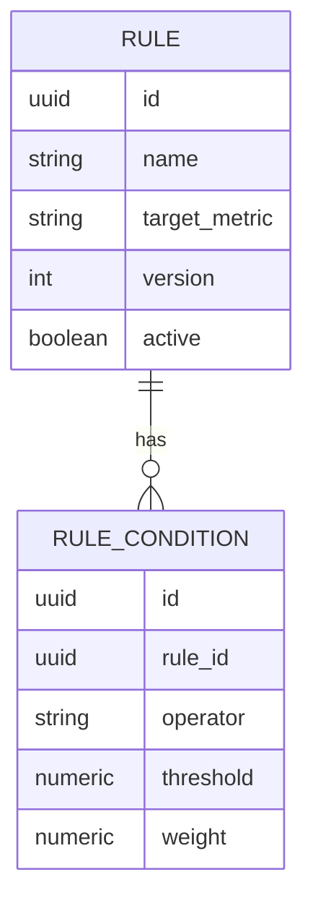
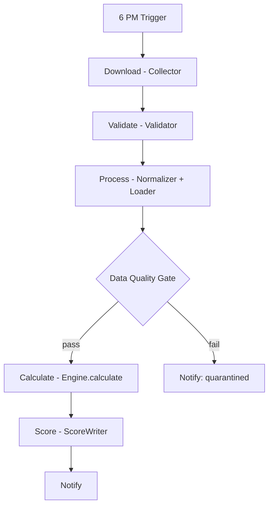

# 002 — Engine Architecture

## 1. Purpose

Defines the generic contracts that every data pipeline and every scoring engine — across all five phases — plugs into. Phase 0 delivers these contracts plus a dummy/no-op implementation to prove the pipeline runs end to end. It does **not** deliver any real scoring logic (no `if (rsi > 60)`, no fundamental thresholds) — that arrives module-by-module starting Phase 1, as concrete implementations of the interfaces defined here.

## 2. ETL Pipeline Contract

Every data source, regardless of domain module, is ingested through the same five-stage pipeline:


| Stage | Responsibility | Interface |
|---|---|---|
| Collector | Fetches raw data from an external source (file, API, scrape) into a raw byte/text form. Knows nothing about the target schema. | `Collector<R>` → `R fetch(SourceConfig)` |
| Parser | Converts raw form into a structured, source-shaped record. | `Parser<R, T>` → `List<T> parse(R)` |
| Validator | Checks structural/business validity of each record; does not mutate. Emits validation errors, does not throw on bad rows — bad rows are quarantined, not fatal. | `Validator<T>` → `ValidationResult validate(T)` |
| Normalizer | Maps source-shaped record to the canonical domain model (units, date formats, symbol resolution against `reference`). | `Normalizer<T, D>` → `D normalize(T)` |
| Loader | Persists the canonical domain record — upsert semantics, idempotent on (source, external_id, as_of_date). | `Loader<D>` → `void load(D)` |

Each domain module registers its own `Collector`/`Parser`/`Normalizer`/`Loader` beans for the sources it owns (e.g. `market` registers an NSE-bhavcopy collector); `Validator`s are composable and can be shared (e.g. a generic "required fields present" validator lives in `common`).

`PipelineDefinition` is the composition root: `SourceConfig + Collector + Parser + Validator + Normalizer + Loader → Pipeline`. The `scheduler` module drives `Pipeline.run()` and records the result — it never constructs pipeline stages itself.

Every run produces a `PipelineExecution` record (see [003_Database_Architecture](003_Database_Architecture.md)) capturing rows read/accepted/rejected, duration, and status, per Module 0.10.

## 3. Data Quality Engine

Runs after every Loader stage, independent of domain, over the batch just loaded. Produces one `DataQualityScore` per (source, run):

| Dimension | Definition |
|---|---|
| Completeness | % of expected fields populated across the batch |
| Duplicates | count of records colliding on natural key before upsert dedup |
| Missing Fields | per-field null-rate for fields marked required in the source's field spec |
| Validation Errors | count/rate of rows the Validator stage rejected |

`QualityScore = f(completeness, duplicateRate, missingFieldRate, validationErrorRate)` — the weighting formula is intentionally **not** fixed in Phase 0; it is itself a `Rule` evaluated by the Rule Engine (§4), so it can be tuned without a code change. Phase 0 ships a placeholder equal-weight formula.

Nothing downstream (scoring engines) is permitted to consume a batch whose quality score falls below a configurable floor — this gate is structural (a check in `scheduler` before advancing to Calculate/Score), not a suggestion.

## 4. Rule Engine

The mechanism that replaces hard-coded thresholds everywhere in the platform, per Module 0.7. Core model:



- **Rule**: a named, versioned thing being evaluated (e.g. "RSI Overbought", "Quality Score Formula"). Only one version of a given rule name is `active` at a time; history is retained, never overwritten, so scores are reproducible against the rule version active when they were computed.
- **Condition**: `operator` (`GT`, `LT`, `GTE`, `LTE`, `EQ`, `BETWEEN`), `threshold`, `weight`. A rule's conditions combine into a single weighted contribution.
- **RuleEvaluator**: `EvaluationResult evaluate(Rule, MetricContext)` — pure function, no side effects, no I/O. `MetricContext` is a flat key→value map of already-computed metrics for one entity (e.g. one stock on one date); the evaluator never fetches data itself.
- Rules are authored/edited via the `api` module (CRUD + activate/deactivate), not via code deploys. This is the concrete mechanism behind "Everything configurable" in Module 0.7.

Phase 0 ships the Rule/Condition schema, the CRUD API, and the `RuleEvaluator` interface with a working arithmetic implementation — but no actual rule content (no real RSI/quality thresholds seeded). Phase 1 engines are the first real consumers.

## 5. Generic Scoring Engine Contract

Every Phase 1+ engine (Technical, Fundamental, Institutional, Sector, Risk, Scoring, Decision, and Phase 2's Corporate Event/Order Book/Management Commentary/News engines) implements the same shape:

```
interface Engine<I, O extends Score> {
    O calculate(I input, RuleSet rules);
}
```

- `I` is the engine's domain input (already-normalized data pulled from its own module's repositories — an engine never reads another module's tables directly, it reads via that module's published `api` interface).
- `O` is a `Score`: a value in a fixed range, a `confidence`, the `RuleSet` version used, and a `computedAt` timestamp. All scores are structurally identical regardless of domain so `intelligence` can aggregate them uniformly.
- `RuleSet` is resolved via the Rule Engine (§4) at calculation time, not hard-coded — this is what makes an engine's behavior configurable without redeployment.
- Engines are pure with respect to already-loaded data: they do not fetch, they do not write pipeline state. `scheduler` calls `Engine.calculate()` during the Calculate/Score stages and the result is persisted by the owning module's `Loader`-equivalent (a `ScoreWriter`).

Phase 0 defines this interface and a no-op `NullEngine` used only to prove the scheduler's Calculate → Score → Notify stages execute correctly end to end.

## 6. Scheduler Orchestration Flow



- No manual execution: every stage is reachable only via `scheduler`'s registered `PipelineDefinition`s, triggered by Spring Scheduler (cron, default 18:00 IST) or, for operational recovery, an authenticated admin API call that re-runs a named pipeline — never a direct engine/loader invocation.
- Every stage transition is logged per Module 0.10 (see [003_Database_Architecture](003_Database_Architecture.md) `pipeline_execution`).
- Notify (Phase 0) is a structural hook (`NotificationPort` interface) with a logging-only implementation; email/webhook implementations arrive when there's something real to notify about.

## 7. Extension Points Summary

| Extension point | Interface | First real implementation |
|---|---|---|
| New data source | `Collector` + `Parser` + `Normalizer` + `Loader` | Phase 1 (`market`, `financial`, `ownership`) |
| New validation | `Validator` | Phase 1 |
| New rule | `Rule` + `RuleCondition` (data, not code) | Phase 1 |
| New scoring engine | `Engine<I, O>` | Phase 1 (Technical, Fundamental, ...) |
| New notification channel | `NotificationPort` | Phase 1+ as needed |
| NLP/ML delegation | Python sidecar call from within an `Engine` implementation | Phase 2 (`corporate`), Phase 4 (`learning`) — see [001_System_Architecture §5](001_System_Architecture.md) |
