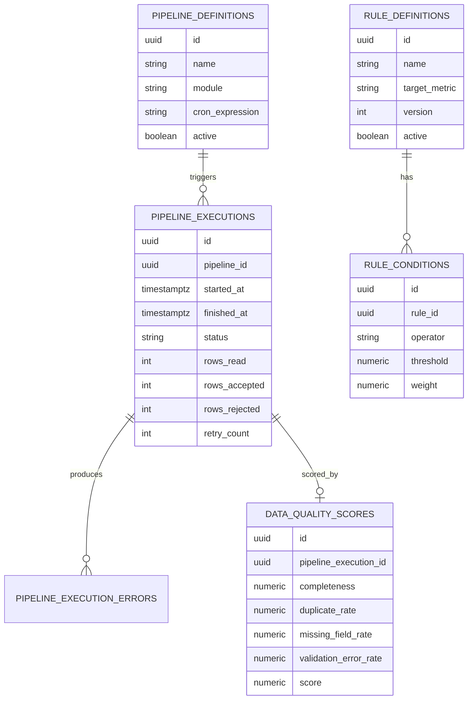

# 003 — Database Architecture

## 1. Purpose

Defines schema layout, naming conventions, migration strategy, and the Phase 0 structural tables. Per Module 0.4: this document is structure only — no business tables (no `stock_price`, no `fundamental_metric`) are created until the module that owns them is built in Phase 1. What Phase 0 does create is the scaffolding every later table will follow, plus the tables the platform itself needs to operate (pipeline logging, rule definitions, data quality scores, reference data).

## 2. Principles

- **Schema-per-module**: one PostgreSQL schema per AlphaGraph module (`common`, `reference`, `market`, `financial`, `ownership`, `corporate`, `sector`, `technical`, `risk`, `intelligence`, `decision`, `learning`). A module's Flyway migrations only ever touch its own schema.
- **Flyway, versioned per module**: migration path `db/migration/<module>/V{n}__description.sql`, each module schema-versioned independently so Phase 1 modules can start their migration history at V1 without renumbering Phase 0's.
- **Naming**: `snake_case` throughout; table names singular is avoided in favor of plural (`rule_definitions`, not `rule_definition`) for consistency with Postgres/JPA convention; every table has a `uuid` primary key (`id`), `created_at`/`updated_at` (`timestamptz`, UTC), and, where relevant, `created_by`.
- **No cross-schema foreign keys**: a table in `intelligence` referencing an entity conceptually owned by `market` stores the id as a plain column, not an FK constraint — this preserves the "module boundary = schema boundary" rule and keeps future extraction to a microservice (own database) mechanical.
- **Soft state, hard history**: mutable configuration (rules, commission-style settings) is never updated in place across a meaningful version — a new row/version is inserted and the old one deactivated, so historical calculations remain reproducible.

## 3. Phase 0 Structural Tables

### `common` schema

Owns nothing business-specific; provides shared enum-like reference tables used across schemas by convention (duplicated by value, not by FK, per §2).

### `reference` schema

| Table | Purpose |
|---|---|
| `exchanges` | Seed data: NSE, BSE, etc. |
| `instruments` | Symbol master — placeholder structure (symbol, exchange, name, isin, instrument_type); populated with seed/dummy rows in Phase 0, real ingestion in Phase 1. |
| `sectors` | Sector/industry classification tree. |
| `trading_calendar` | Market holidays/trading days, used by `scheduler` to skip non-trading days. |

### `scheduler`-owned tables (Module 0.10 logging)

| Table | Purpose |
|---|---|
| `pipeline_definitions` | Registered pipelines (name, module, cron expression, active flag). |
| `pipeline_executions` | One row per run: `pipeline_id`, `started_at`, `finished_at`, `status` (`RUNNING`/`SUCCESS`/`FAILED`/`PARTIAL`), `rows_read`, `rows_accepted`, `rows_rejected`, `retry_count`, `correlation_id` (nullable — added Module 0.10; the `X-Request-Id` of the triggering API call, or a generated `cron-<uuid>` for scheduled runs). |
| `pipeline_execution_errors` | One row per failure/rejected-row cause, FK to `pipeline_executions`, with a message and the offending source record reference. |

### `common`-owned engine tables (Rule Engine + Data Quality, per [002_Engine_Architecture](002_Engine_Architecture.md))

| Table | Purpose |
|---|---|
| `rule_definitions` | `id`, `name`, `target_metric`, `version`, `active`, `created_at`. Unique on (`name`, `version`); at most one `active=true` row per `name`. |
| `rule_conditions` | `id`, `rule_id` (FK), `operator`, `threshold`, `upper_bound` (nullable; required and only meaningful when `operator = BETWEEN`, as the range's upper bound — `threshold` is the lower bound), `weight`. |
| `data_quality_scores` | `id`, `pipeline_execution_id` (FK), `completeness`, `duplicate_rate`, `missing_field_rate`, `validation_error_rate`, `score`, `computed_at`. |

### `api`-support (auth, Phase 0 minimal)

| Table | Purpose |
|---|---|
| `platform_users` | Internal/admin users only in Phase 0 (no renter/provider-style consumer accounts here — AlphaGraph has no such concept). `id`, `email`, `password_hash`, `role` (`ADMIN`, `SYSTEM`), `active`. |

## 4. Schema Ownership Diagram

## 5. Migration Strategy

- Each module's Flyway config points at its own schema (`flyway.schemas=<module>`, `flyway.locations=classpath:db/migration/<module>`), all run from a single Spring Boot startup (multiple `Flyway` beans, one per module) so the monolith still yields one deployable with independently versioned schema histories.
- Baseline migration per module (`V1__init_schema.sql`) creates the schema itself plus its Phase 0 tables.
- No destructive migrations (`DROP COLUMN`, `ALTER TYPE` narrowing) without an explicit backfill migration preceding it — enforced by review, not tooling, in Phase 0.
- Seed data (Module 0.4: exchanges, a handful of dummy instruments, one sector tree) ships as `V2__seed_reference_data.sql` in `reference`, guarded by `ON CONFLICT DO NOTHING` so it's safe to re-run across environments.

## 6. Indexing & Constraints Conventions

- Every FK column is indexed explicitly (Postgres does not do this automatically).
- `pipeline_executions(pipeline_id, started_at DESC)` — supports "latest run per pipeline" lookups from the scheduler and dashboards.
- `rule_definitions` unique partial index `(name) WHERE active = true` — enforces the "at most one active version" rule at the database level, not just in application code.
- All `timestamptz` columns default to `now()` at insert; `updated_at` maintained via a shared trigger function defined once in each schema's baseline migration.
